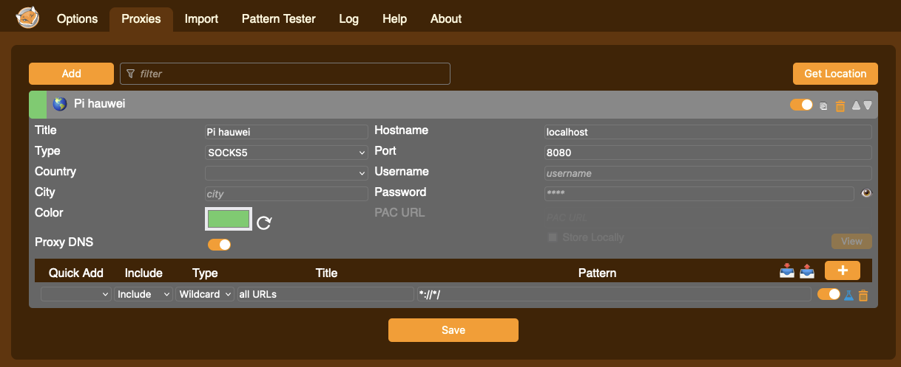

# timelapse
A set of tools/scripts to automate the taking and creation of timelapse videos and videos with a Raspberry Pi

# Current issues with PiJuice
> [!warning]
> At present (November 2023), I cannot recommend using PiJuice as the BMS provider.
> 
> I am having a number of PiJuice reliability issues even when using PiSupply's own batteries.
> 
> Since their merger with or aquisition by Nebra, I've found attempts to purchase batteries from PiSupply to be unsuccessful as their payment options are not working. Attempts to contact them on Twitter go unanswered.
> 
> If this situation changes, I will update this warning. Last updated 23 November 2023.

# PI Setup

Raspberry Pi OS Lite (32 bit - Pi Zero W)
Debian version 11 (bullseye) - https://downloads.raspberrypi.org/raspios_lite_armhf/images/raspios_lite_armhf-2022-09-26/2022-09-22-raspios-bullseye-armhf-lite.img.xz

Raspberry Pi OS Lite (64 bit - Pi Zero 2 W
Debian version 11 - https://downloads.raspberrypi.org/raspios_lite_arm64/images/raspios_lite_arm64-2022-01-28/2022-01-28-raspios-bullseye-arm64-lite.zip

Burn using Pi Imager. Give a default name, but you can change this inthe install script below.

Set username and password, and authentication methods as desired.

## All versions up to Bullseye.

Mount (reinsert) SD card
<!-- diskutil mount /dev/disk4s1 -->
```
cp ~/wpa_supplicant.conf /Volumes/bootfs
diskutil unmount /Volumes/bootfs
```

If updating the wpa_supplicant file, and you have network access:
```
scp ~/wpa_supplicant.conf pi@[pi name]:~
```
And then on the pi:
```
sudo cp ~/wpa_supplicant.conf /etc/wpa_supplicant/wpa_supplicant.conf
sudo reboot
```

## Bookworm onwards:
Bookworm uses NetorkManager rather than WPA Supplicant.

Ensure you have local wifi network access when you burn the image.

Individual network addition:
```
sudo nmcli dev wifi connect <wifi-ssid> password "<network-password>"
```

```
scp ~/nmcli-connect.sh pi@[pi name]:~
```
And then on the pi:
```
chmod u+x ~/nmcli-connect.sh
sudo ./nmcli-connect.sh
```

Note - this will only connect to WIFI networks that are present, so ensure modem stays with camera.


Turn on and find the pi
Pi Zero W 2:
```
arp -a | grep e4:5f
raspberrypi.lan (192.168.86.37) at e4:5f:1:5a:6e:b3 on en0 ifscope [ethernet]
```

Pi Zero W:
```
arp -a | grep b8:27
raspberrypi.lan (192.168.86.32) at b8:27:eb:94:ac:b1 on en0 ifscope [ethernet]

```

# Install (or update) software, (LiPo and LiFePO4, sedicam v2 configuration) config & code to new Pi:
```
sudo apt-get install byobu -y
byobu-enable
byobu
```
```
bash <(curl -fsSL "https://github.com/venari/timelapse/raw/main/install.sh?$RANDOM")
```

# Connect to intermitently connected Pi and tail log:
```
ssh -o ConnectTimeout=60 -o ConnectionAttempts=30 pi@sediment-pi-zero-w-v1-a 'tail -f -n 100 logs/timelapse.log'
```

Connect to intermitently connected Pi and trigger reboot:
```
ssh -o ConnectTimeout=60 -o ConnectionAttempts=30 pi@sediment-pi-zero-w-v1-a 'sudo reboot now'
```

Copy log files to local machine:
```
scp -o ConnectTimeout=60 -o ConnectionAttempts=30 pi@sediment-pi-zero-w-v1-a:/home/pi/logs/*.* .
```

# Review systemd job status
```
watch --color SYSTEMD_COLORS=1 systemctl status enviro*.service
```

# restart a systemd job
```
sudo systemctl restart envirocam-telemetry
sudo systemctl restart envirocam*
```

# Waveshare SIM6700X GSM/GPRS/GNSS HAT

- Enable Serial Communication
```
sudo raspi-config nonint do_serial 2        # Disable serial login shell and enable serial port hardware
sudo reboot
```

https://core-electronics.com.au/guides/raspberry-pi/raspberry-pi-4g-gps-hat/
```
sudo apt-get install minicom
pip3 install pyserial
wget https://www.waveshare.com/w/upload/2/29/SIM7600X-4G-HAT-Demo.7z
sudo apt-get install p7zip-full

7z x SIM7600X-4G-HAT-Demo.7z -r -o/home/pi

sudo chmod 777 -R /home/pi/SIM7600X-4G-HAT-Demo


sudo nano /etc/rc.local

```
Add following line, just above `exit 0`:

```
sh /home/pi/SIM7600X-4G-HAT-Demo/Raspberry/c/sim7600_4G_hat_init
```

```
cd /home/pi/SIM7600X-4G-HAT-Demo/Raspberry/c/bcm2835
chmod +x configure && ./configure && sudo make && sudo make install
```

Plug in USB cable, testing with minicom
CTRL-A, E to echo
CTRL-A, Q to exit
```
minicom -D /dev/ttyUSB2

AT+CPIN?
+CME ERROR:10 # No SIM card
```

Switch to RNDIS dial up mode
https://www.waveshare.com/wiki/Raspberry_Pi_RNDIS_dial-up_Internet_access
```
AT+CUSBPIDSWITCH=9011,1,1
```

Nope - prevents camera from working...

    Disable HDMI:
    https://picockpit.com/raspberry-pi/raspberry-pi-zero-2-battery/

    sudo raspi-config

    Then, go to Advanced Options -> GL Driver -> Legacy

    Add to /etc/rc.local:
    /usr/bin/tvservice -o

<!-- `camera.lensposition` - 1/distance in metres
- '0' - infinity
- '1': 1m
- `5`: 20cm
- `10`: 10cm -->

<!-- `camera.focus_m`: focus in metres -->

<!-- Add following to /boot/config.txt
```
dtoverlay=imx708
``` -->

# Waveshare 1.54" e-Paper Module
## Not may not work on Bookworm

https://github.com/waveshareteam/e-Paper/blob/master/RaspberryPi_JetsonNano/python/examples/epd_1in54b_V2_test.py

```
    sudo apt-get update
    sudo apt-get install python3-pip
    sudo apt-get install python3-pil
    sudo pip3 install RPi.GPIO
    sudo pip3 install waveshare-epaper
```

Onboard image resizing
```
sudo apt-get install imagemagick

convert pic/image.org.jpg -resize 200x200 -background white -gravity center -extent 200x200 pic/image.jpg 
```

- Enable Serial Communication
```
sudo raspi-config nonint do_spi 0        
sudo reboot
```

# Uptimed service

```
sudo apt-get install uptimed
sudo systemctl enable uptimed
```

# preview image over VNC
https://www.youtube.com/watch?v=dbBWyeHbGs0&ab_channel=WillyKjellstrom

Set screen VNC resolution:
sudo raspi-config
	-> 2 Display Options
		-> D5 VNC Resolution

To disable:
https://help.realvnc.com/hc/en-us/articles/5060068870813-Disabling-direct-capture-on-Raspberry-Pi-using-the-command-line
sudo sed -i '/CaptureTech/d' /root/.vnc/config.d/vncserver-x11
sudo vncserver-x11 -service -reload

Issues in Bullseye on Zero2? https://www.raspberrypi.com/news/bullseye-camera-system/

- related - possibly not - https://github.com/raspberrypi/libcamera-apps/issues/278
- 

# Access Hauwei thumb stick web interface (password is fiddly)
```
ssh -D 8080 pi@sediment-pi-[machine name]
```

Use FoxyProxy and setup proxy to localhost:8080

Browse to http://192.168.1.1/html/index.html or http://192.168.8.1/html/index.html

# On board timelapse generation

```
ffmpeg -r 30 -f image2 -pattern_type glob -i "./<YYYY-MM-DD>*.jpg" -s 1014x760 -vcodec libx264 <YYYY-MM-DD>.mp4
```

# Other timelapse generation examples

```
ffmpeg -r 30 -f image2 -pattern_type glob -i  "*11_2023-01-03*.jpg" -s 3280x1844 -vcodec libx264 output.mp4
```

## Overlay label and date/time in images:
```
mkdir -p mod

label="<Label for bottom left>"

for filename in <filter>_*.jpg; do 
    date_time="$(echo ${filename:3:10} ${filename:14:2}\\:${filename:16:2})"
    ffmpeg -i $filename -y -vf "drawtext=fontfile=/System/Library/Fonts/Avenir.ttc:text='$label':fontcolor=white:fontsize=90:box=1:boxcolor=black@0.3:boxborderw=5:x=10:y=h-th-10,drawtext=fontfile=/System/Library/Fonts/Avenir.ttc:text='$date_time':fontcolor=white:fontsize=90:box=1:boxcolor=black@0.3:boxborderw=5:x=w-tw-10:y=h-th-10" -hide_banner -loglevel error mod/$filename
done

ffmpeg  -pattern_type glob -i "mod/14_*.jpg" -vf "scale='min(1280,iw)':-2,format=yuv420p" -c:v libx264 -preset medium -profile:v main -c:a aac -shortest -movflags +faststart ../Output/<SiteName>.mp4
```

# Video stabilization

https://www.paulirish.com/2021/video-stabilization-with-ffmpeg-and-vidstab/

```
ffmpeg -i unstabilized.mp4 -vf vidstabdetect -f null -
ffmpeg -i unstabilized.mp4 -vf vidstabdetect=shakiness=1:tripod=1 -f null -
ffmpeg -i unstabilized.mp4 -vf vidstabtransform stabilized.mp4
```

Comparison video:
```
# vertically stacked
ffmpeg -i unstabilized.mp4 -i stabilized.mp4  -filter_complex vstack compare-stacked.mp4

# side-by-side
ffmpeg -i unstabilized.mp4 -i stabilized.mp4  -filter_complex hstack compare-sxs.mp4
```

# API Setup
Prerequisites:
- [Dotnet 6](https://dotnet.microsoft.com/en-us/download)
- [EFCore Tooling](https://docs.microsoft.com/en-au/ef/)
```
brew install dotnet-sdk
brew install pgadmin4
dotnet tool install --global dotnet-ef
```

Postgres DB Server:
```

docker pull postgres

mkdir ${HOME}/postgres-data/


docker run -d \
	--name dev-postgres \
	-e POSTGRES_PASSWORD=Pass2020! \
	-v ${HOME}/postgres-data/:/var/lib/postgresql/data \
        -p 5432:5432 \
        postgres


docker exec -it dev-postgres bash        
```

User Secrets:
```
dotnet tool install dotnet-user-secrets
dotnet user-secrets --project timelapse.api init
dotnet user-secrets --project timelapse.api set "ConnectionStrings:DefaultConnection" "Host=localhost;Port=5432;User ID=postgres;Password=Pass2020!;Database=timelapse"
```


When making changes to the objects in the code, add migrations and update the database script:
```
dotnet ef --project timelapse.api migrations add --context "AppDbContext" <migrationName>
dotnet ef --project timelapse.api migrations script -i --context "AppDbContext" -o timelapse.api/Migrations/scripts.sql
```

Updating database:
```
dotnet ef --project timelapse.api database update
```


# Enable Wake Up and set RTC Time

Note - Wake up should be automatically enabled in `saveTelemetry.py`, but you will need to set the RTC time during installation.
```
░░░░░░░░░░░░░░░░░░░░░░░░░░░░░░░░░░░░░░░░░░░░░░░░░░░░░░░░░░░░░░░░░░░░░░░░░░
░░░░░░░░░░░░░░░░░░░░░░░░░░░░░░░░░░░░░░░░░░░░░░░░░░░░░░░░░░░░░░░░░░░░░░░░░░
░░░░░░░░░░░░░░░░░░░░░░░░░░░░░░░░░░░░░░░░░░░░░░░░░░░░░░░░░░░░░░░░░░░░░░░░░░
░░░░░┌───────────────────────── PiJuice CLI ────────────────────────┐░░░░░
░░░░░│  Wakeup Alarm                                                │░░░░░
░░░░░│                                                              │░░░░░
░░░░░│  Status: OK                                                  │░░░░░
░░░░░│  UTC Time: Sun 2000-01-02 19:36:02                           │░░░░░
░░░░░│  [ ] Wakeup enabled                                          │░░░░░
░░░░░│  < Set RTC time    >                                         │░░░░░
░░░░░│                                                              │░░░░░
░░░░░│  (X) Day                      ( ) Weekday                    │░░░░░
░░░░░│  Day: 0                       [ ] Every day                  │░░░░░
░░░░░│  Hour: 0                      [ ] Every hour                 │░░░░░
░░░░░│                                                              │░░░░░
░░░░░│  (X) Minute                   ( ) Minutes period             │░░░░░
░░░░░│  Minute: 0                                                   │░░░░░
░░░░░│  Second: 0                                                   │░░░░░
░░░░░│                                                              │░░░░░
░░░░░│  < Set alarm >                                               │░░░░░
░░░░░│  < Back      >                                               │░░░░░
░░░░░│                                                              │░░░░░
░░░░░└──────────────────────────────────────────────────────────────┘░░░░░
░░░░░░░░░░░░░░░░░░░░░░░░░░░░░░░░░░░░░░░░░░░░░░░░░░░░░░░░░░░░░░░░░░░░░░░░░░
░░░░░░░░░░░░░░░░░░░░░░░░░░░░░░░░░░░░░░░░░░░░░░░░░░░░░░░░░░░░░░░░░░░░░░░░░░
░░░░░░░░░░░░░░░░░░░░░░░░░░░░░░░░░░░░░░░░░░░░░░░░░░░░░░░░░░░░░░░░░░░░░░░░░░
░░░░░░░░░░░░░░░░░░░░░░░░░░░░░░░░░░░░░░░░░░░░░░░░░░░░░░░░░░░░░░░░░░░░░░░░░░
〣 10 0:-*               3m 1.00 1.0GHz 367M13% 14G12% 2022-04-05 02:22:05


░░░░░░░░░░░░░░░░░░░░░░░░░░░░░░░░░░░░░░░░░░░░░░░░░░░░░░░░░░░░░░░░░░░░░░░░░░
░░░░░░░░░░░░░░░░░░░░░░░░░░░░░░░░░░░░░░░░░░░░░░░░░░░░░░░░░░░░░░░░░░░░░░░░░░
░░░░░░░░░░░░░░░░░░░░░░░░░░░░░░░░░░░░░░░░░░░░░░░░░░░░░░░░░░░░░░░░░░░░░░░░░░
░░░░░┌───────────────────────── PiJuice CLI ────────────────────────┐░░░░░
░░░░░│  Wakeup Alarm                                                │░░░░░
░░░░░│                                                              │░░░░░
░░░░░│  Status: OK                                                  │░░░░░
░░░░░│  UTC Time: Tue 2022-04-05 01:23:15                           │░░░░░
░░░░░│  [X] Wakeup enabled                                          │░░░░░  <---
░░░░░│  < Set RTC time    >                                         │░░░░░  <---
░░░░░│                                                              │░░░░░
░░░░░│  (X) Day                      ( ) Weekday                    │░░░░░
░░░░░│  Day: 0                       [ ] Every day                  │░░░░░
░░░░░│  Hour: 0                      [ ] Every hour                 │░░░░░
░░░░░│                                                              │░░░░░
░░░░░│  ( ) Minute                   (X) Minutes period             │░░░░░  <---
░░░░░│  Minute: 10                                                  │░░░░░  <---
░░░░░│  Second: 0                                                   │░░░░░
░░░░░│                                                              │░░░░░
░░░░░│  < Set alarm >                                               │░░░░░
░░░░░│  < Back      >                                               │░░░░░
░░░░░│                                                              │░░░░░
░░░░░└──────────────────────────────────────────────────────────────┘░░░░░
░░░░░░░░░░░░░░░░░░░░░░░░░░░░░░░░░░░░░░░░░░░░░░░░░░░░░░░░░░░░░░░░░░░░░░░░░░
░░░░░░░░░░░░░░░░░░░░░░░░░░░░░░░░░░░░░░░░░░░░░░░░░░░░░░░░░░░░░░░░░░░░░░░░░░
░░░░░░░░░░░░░░░░░░░░░░░░░░░░░░░░░░░░░░░░░░░░░░░░░░░░░░░░░░░░░░░░░░░░░░░░░░
░░░░░░░░░░░░░░░░░░░░░░░░░░░░░░░░░░░░░░░░░░░░░░░░░░░░░░░░░░░░░░░░░░░░░░░░░░
〣 10 0:-*               3m 1.00 1.0GHz 367M13% 14G12% 2022-04-05 02:23:15

```

# Battery min sleep/wake up levels:

```
░░░░░░░░░░░░░░░░░░░░░░░░░░░░░░░░░░░░░░░░░░░░░░░░░░░░░░░░░░░░░░░░░░░░░░░░░░░░░░░░░░░░░
░░░░░░░░░░░░░░░░░░░░░░░░░░░░░░░░░░░░░░░░░░░░░░░░░░░░░░░░░░░░░░░░░░░░░░░░░░░░░░░░░░░░░
░░░░░░░░░░┌───────────────────────── PiJuice CLI ────────────────────────┐░░░░░░░░░░░
░░░░░░░░░░│  System Task                                                 │░░░░░░░░░░░
░░░░░░░░░░│                                                              │░░░░░░░░░░░
░░░░░░░░░░│  [X] System task enabled                                     │░░░░░░░░░░░
░░░░░░░░░░│                                                              │░░░░░░░░░░░
░░░░░░░░░░│  [ ] Watchdog            Expire period          [ ] Restore  │░░░░░░░░░░░
░░░░░░░░░░│                          [minutes]: 4                        │░░░░░░░░░░░
░░░░░░░░░░│                                                              │░░░░░░░░░░░
░░░░░░░░░░│  [X] Wakeup on charge    Trigger level [%]: 20  [X] Restore  │░░░░░░░░░░░
░░░░░░░░░░│                                                              │░░░░░░░░░░░
░░░░░░░░░░│  [X] Min charge          Threshold [%]: 10                   │░░░░░░░░░░░
░░░░░░░░░░│                                                              │░░░░░░░░░░░
░░░░░░░░░░│  [ ] Min battery voltage 3.3                                 │░░░░░░░░░░░
░░░░░░░░░░│                                                              │░░░░░░░░░░░
░░░░░░░░░░│  [X] Software Halt Power Delay period [seconds]: 20          │░░░░░░░░░░░
░░░░░░░░░░│      Off                                                     │░░░░░░░░░░░
░░░░░░░░░░│                                                              │░░░░░░░░░░░
░░░░░░░░░░│  < Refresh        >                                          │░░░░░░░░░░░
░░░░░░░░░░│  < Apply settings >                                          │░░░░░░░░░░░
░░░░░░░░░░└──────────────────────────────────────────────────────────────┘░░░░░░░░░░░
░░░░░░░░░░░░░░░░░░░░░░░░░░░░░░░░░░░░░░░░░░░░░░░░░░░░░░░░░░░░░░░░░░░░░░░░░░░░░░░░░░░░░
░░░░░░░░░░░░░░░░░░░░░░░░░░░░░░░░░░░░░░░░░░░░░░░░░░░░░░░░░░░░░░░░░░░░░░░░░░░░░░░░░░░░░
```

# System Events

```
[X] Low Charge : <SYS_FUNC_HALT_POW_OFF>

```

# Battery Profiles

[Headway 38120s 10ah lifepo4 cell](https://evshop.eu/en/batteries/213-headway-lifepo4-38120s-32v-10ah.html)

```

░░░░░░░░░░░░░░░░░░░░░░░░░░░░░░░░░░░░░░░░░░░░░░░░░░░░░░░░░░░░░░░░░░░░░░░░░░
░░░░░┌───────────────────────── PiJuice CLI ────────────────────────┐░░░░░
░░░░░│  Battery settings                                            │░░░░░
░░░░░│                                                              │░░░░░
░░░░░│  Status: Custom profile by: HOST                             │░░░░░
░░░░░│  < Profile: CUSTOM       >                                   │░░░░░
░░░░░│                                                              │░░░░░
░░░░░│  [X] Custom                                                  │░░░░░  <-- Set to Custom
░░░░░│  Chemistry:                LIFEPO4                           │░░░░░  <-- Set to LIFEPO4
░░░░░│  Capacity [mAh]:           15000                             │░░░░░  <-- Set to 15000
░░░░░│  Charge current [mA]:      2500                              │░░░░░  <-- Set to 2500
░░░░░│  Termination current [mA]: 50                                │░░░░░
░░░░░│  Regulation voltage [mV]:  3600                              │░░░░░  <-- Set to 3600
░░░░░│  Cutoff voltage [mV]:      2500                              │░░░░░  <-- Set to 2500
░░░░░│  Cold temperature [C]:     0                                 │░░░░░
░░░░░│  Cool temperature [C]:     2                                 │░░░░░
░░░░░│  Warm temperature [C]:     49                                │░░░░░
░░░░░│  Hot temperature [C]:      65                                │░░░░░
░░░░░│  NTC B constant [1k]:      3450                              │░░░░░
░░░░░│  NTC resistance [ohm]:     10000                             │░░░░░
░░░░░│  OCV10 [mV]:               3131                              │░░░░░  <-- Set to 3131
░░░░░│  OCV50 [mV]:               3263                              │░░░░░  <-- Set to 3263
░░░░░│  OCV90 [mV]:               3303                              │░░░░░  <-- Set to 3303
░░░░░│  R10 [mOhm]:               91.0                              │░░░░░  <-- Set to 91
░░░░░│  R50 [mOhm]:               83.0                              │░░░░░  <-- Set to 83
░░░░░│  R90 [mOhm]:               76.0                              │░░░░░  <-- Set to 76
░░░░░│                                                              │░░░░░
░░░░░│  < Temperature sense: ON_BOARD    >                          │░░░░░  <-- Set to ON_BOARD
░░░░░│                                                              │░░░░░
░░░░░│  < Rsoc estimation: DIRECT_BY_MCU >                          │░░░░░  <-- Set to DIRECT_BY_MCU
░░░░░│                                                              │░░░░░
░░░░░│  < Refresh        >                                          │░░░░░
░░░░░│  < Apply settings >                                          │░░░░░
░░░░░│  < Back           >                                          │░░░░░
░░░░░└──────────────────────────────────────────────────────────────┘░░░░░
░░░░░░░░░░░░░░░░░░░░░░░░░░░░░░░░░░░░░░░░░░░░░░░░░░░░░░░░░░░░░░░░░░░░░░░░░░
░░░░░░░░░░░░░░░░░░░░░░░░░░░░░░░░░░░░░░░░░░░░░░░░░░░░░░░░░░░░░░░░░░░░░░░░░░

```

# Status Indication script

```
░░░░░░░░░░░░░░░░░░░░░░░░░░░░░░░░░░░░░░░░░░░░░░░░░░░░░░░░░░░░░░░░░░░░░░░░░
░░░░░░░░░░░░░░░░░░░░░░░░░░░░░░░░░░░░░░░░░░░░░░░░░░░░░░░░░░░░░░░░░░░░░░░░░
░░░░░┌───────────────────────── PiJuice CLI ────────────────────────┐░░░░
░░░░░│  User Scripts                                                │░░░░
░░░░░│                                                              │░░░░
░░░░░│  USER FUNC1:                                                 │░░░░
░░░░░│  /home/pi/dev/timelapse/scripts/indicateStatus.sh            │░░░░
░░░░░│  USER FUNC2:                                                 │░░░░
░░░░░│  USER FUNC3:                                                 │░░░░
░░░░░│  USER FUNC4:                                                 │░░░░
░░░░░│  USER FUNC5:                                                 │░░░░
░░░░░│  USER FUNC6:                                                 │░░░░
░░░░░│  USER FUNC7:                                                 │░░░░
░░░░░│  USER FUNC8:                                                 │░░░░
░░░░░│  USER FUNC9:                                                 │░░░░
░░░░░│  USER FUNC10:                                                │░░░░
░░░░░│  USER FUNC11:                                                │░░░░
░░░░░│  USER FUNC12:                                                │░░░░
░░░░░│  USER FUNC13:                                                │░░░░
░░░░░│  USER FUNC14:                                                │░░░░
░░░░░│  USER FUNC15:                                                │░░░░
░░░░░└──────────────────────────────────────────────────────────────┘░░░░
░░░░░░░░░░░░░░░░░░░░░░░░░░░░░░░░░░░░░░░░░░░░░░░░░░░░░░░░░░░░░░░░░░░░░░░░░
░░░░░░░░░░░░░░░░░░░░░░░░░░░░░░░░░░░░░░░░░░░░░░░░░░░░░░░░░░░░░░░░░░░░░░░░░


░░░░░░░░░░░░░░░░░░░░░░░░░░░░░░░░░░░░░░░░░░░░░░░░░░░░░░░░░░░░░░░░░░░░░░░░░
░░░░░░░░░░░░░░░░░░░░░░░░░░░░░░░░░░░░░░░░░░░░░░░░░░░░░░░░░░░░░░░░░░░░░░░░░
░░░░░┌───────────────────────── PiJuice CLI ────────────────────────┐░░░░
░░░░░│  Settings for SW1                                            │░░░░
░░░░░│                                                              │░░░░
░░░░░│  < PRESS: USER_FUNC1, 0                       >              │░░░░
░░░░░│  < RELEASE: NO_FUNC, 0                        >              │░░░░
░░░░░│  < SINGLE_PRESS: HARD_FUNC_POWER_ON, 800      >              │░░░░
░░░░░│  < DOUBLE_PRESS: NO_FUNC, 0                   >              │░░░░
░░░░░│  < LONG_PRESS1: SYS_FUNC_HALT, 10000          >              │░░░░
░░░░░│  < LONG_PRESS2: HARD_FUNC_POWER_OFF, 20000    >              │░░░░
░░░░░│                                                              │░░░░
░░░░░│  < Back >                                                    │░░░░
░░░░░│                                                              │░░░░
░░░░░│                                                              │░░░░
░░░░░│                                                              │░░░░
░░░░░│                                                              │░░░░
░░░░░│                                                              │░░░░
░░░░░│                                                              │░░░░
░░░░░│                                                              │░░░░
░░░░░│                                                              │░░░░
░░░░░└──────────────────────────────────────────────────────────────┘░░░░
░░░░░░░░░░░░░░░░░░░░░░░░░░░░░░░░░░░░░░░░░░░░░░░░░░░░░░░░░░░░░░░░░░░░░░░░░
░░░░░░░░░░░░░░░░░░░░░░░░░░░░░░░░░░░░░░░░░░░░░░░░░░░░░░░░░░░░░░░░░░░░░░░░░
```

## Troubleshooting PiJuice wakeup:

```
python3 /usr/bin/pijuice_log.py --enable WAKEUP_EVT
```

## Troubleshooting indicateStatus script:
```
sudo -u pijuice /home/pi/dev/timelapse/scripts/indicateStatus.sh
```

# Battery notes

Naccon 3.7V 26650HP 5000mAh
On continuously
Charge from wall charger about 5 hours
Discharge 95 -> 5% about 12 hours.
Discharge 4 -> 1$ about 10 hours.


# Tailscale setup (optional)

Using [tailscale](https://github.com/tailscale/tailscale) to manage updates to pi's:

From https://tailscale.com/download/linux/rpi-bullseye:

```
curl -fsSL https://tailscale.com/install.sh | sh
```

```
sudo tailscale up
```


# To access modem/SMS messages

Use SSH to establish a dynamic port forwarding session to the pi.

```
ssh -D 8080 pi@<device name>
```

Use FoxyProxy to route local traffic on port 8080 through the SSH tunnel.



Then browse to the modem's IP address (e.g. http://192.168.1.1)


# To check code versions
```
pssh --hosts ~/dev/venari/timelapse/hosts.txt -t 900 -i 'cd dev/timelapse; git log -1'
pssh --hosts ~/dev/venari/timelapse/hosts.txt -t 900 -x '-o ConnectTimeout=60 -o ConnectionAttempts=15' -i 'cd dev/timelapse; git log -1;git status'
pssh --hosts ~/dev/venari/timelapse/hosts.txt -t 900 -x '-o ConnectTimeout=60 -o ConnectionAttempts=15' -i 'cd dev/timelapse; git diff'
```


# Credits

3D models

- Raspberry Pi Camera Module v3 STL files: https://www.printables.com/model/368779-raspberry-pi-camera-module-3-v3/