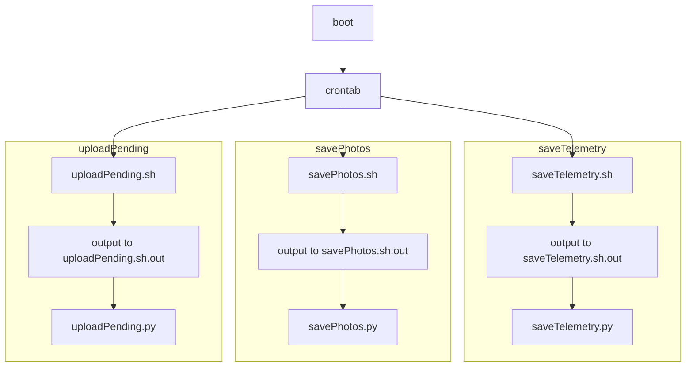

```mermaid
graph TD
    boot --> crontab
    crontab --> saveTelemetry.sh
    crontab --> savePhotos.sh
    crontab --> uploadPending.sh

    subgraph saveTelemetry
    saveTelemetry.sh --> outTel[output to saveTelemetry.sh.out]
    outTel --> saveTelemetry.py
    end

    subgraph savePhotos
    savePhotos.sh --> outPhotos[output to savePhotos.sh.out]
    outPhotos --> savePhotos.py
    end

    subgraph uploadPending
    uploadPending.sh --> outPending[output to uploadPending.sh.out]
    outPending --> uploadPending.py
    end
```
