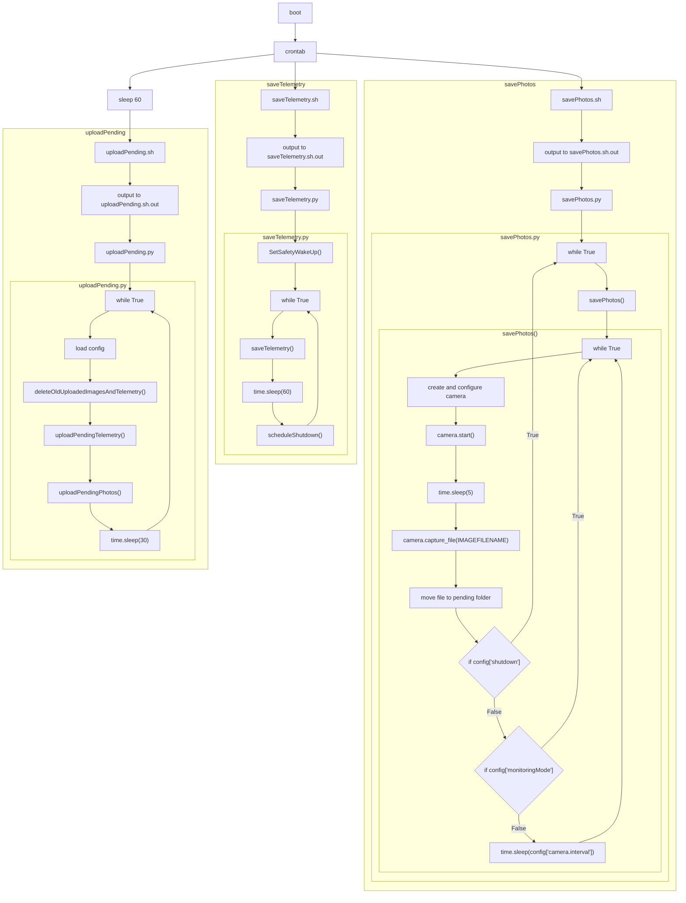

```mermaid
graph TD
    boot --> crontab
    crontab --> saveTelemetry.sh
    crontab --> savePhotos.sh
    crontab --> sleep[sleep 60] --> uploadPending.sh

    subgraph saveTelemetry
    saveTelemetry.sh --> outTel[output to saveTelemetry.sh.out]
    outTel --> saveTelemetry.py
    saveTelemetry.py --> safetyWakeup["SetSafetyWakeUp()"]
    subgraph saveTelemetrypy[saveTelemetry.py]
    safetyWakeup --> saveTelLoop[while True]
    saveTelLoop --> saveTelF["saveTelemetry()"] --> sleep3["time.sleep(60)"] --> scheduleShutdown["scheduleShutdown()"] --> saveTelLoop
    end
    end

    subgraph savePhotos
    savePhotos.sh --> outPhotos[output to savePhotos.sh.out]
    outPhotos --> savePhotos.py
    savePhotos.py --> savePhotosLoop
    subgraph savePhotospy[savePhotos.py]
    savePhotosLoop[while True] --> savePhotosF["savePhotos()"]
    savePhotosF --> savePhotosLoop2
    subgraph savePhotosFg["savePhotos()"]
    savePhotosLoop2[while True] --> camCreateConf[create and configure camera] --> camStart["camera.start()"] --> camSleep["time.sleep(5)"] --> saveCam["camera.capture_file(IMAGEFILENAME)"] --> moveCamFile[move file to pending folder] --> savePhotosIf{"if config['shutdown']"}
    savePhotosIf -- False --> savePhotosIf2{"if config['monitoringMode']"}
    savePhotosIf2 -- True --> savePhotosLoop2
    savePhotosIf2 -- False --> savePhotosIf2Sleep["time.sleep(config['camera.interval'])"] --> savePhotosLoop2
    end
    savePhotosIf -- True --> savePhotosLoop

    end
    end

    subgraph uploadPending
    uploadPending.sh --> outPending[output to uploadPending.sh.out]
    outPending --> uploadPending.py --> upPendingLoop[while True]
    subgraph uploadPendingpy[uploadPending.py]
    upPendingLoop --> loadConfig[load config] --> deleteOld["deleteOldUploadedImagesAndTelemetry()"] --> upPenTel["uploadPendingTelemetry()"] --> upPenPhot["uploadPendingPhotos()"] --> sleep2["time.sleep(30)"]
    sleep2 --> upPendingLoop
    end
    end
```
